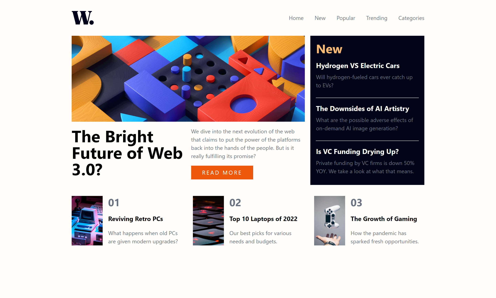

# Frontend Mentor - News homepage solution

This is a solution to the [News homepage challenge on Frontend Mentor](https://www.frontendmentor.io/challenges/news-homepage-H6SWTa1MFl). Frontend Mentor challenges help you improve your coding skills by building realistic projects.

## Table of contents

- [Frontend Mentor - News homepage solution](#frontend-mentor---news-homepage-solution)
  - [Table of contents](#table-of-contents)
  - [Overview](#overview)
    - [The challenge](#the-challenge)
    - [Screenshot](#screenshot)
    - [Links](#links)
  - [My process](#my-process)
    - [Built with](#built-with)
    - [What I learned](#what-i-learned)
    - [Continued development](#continued-development)
    - [Useful resources](#useful-resources)
  - [Author](#author)

## Overview

### The challenge

Users should be able to:

- View the optimal layout for the interface depending on their device's screen size
- See hover and focus states for all interactive elements on the page

### Screenshot

### Links

- Solution URL: [News-homepage](https://github.com/Charlie025x/News-homepage)
- Live Site URL: [News-homepage](https://Charlie025x.github.io/News-homepage/)

## My process

### Built with

- Semantic HTML5 markup
- Flexbox
- CSS Grid
- Mobile-first workflow
- [React](https://reactjs.org/) - JS library
- [Tailwind](https://tailwindcss.com/) - For styles

### What I learned

I learned how to reorder grid items when the screen size changes, and I also learned how to make an animated nav menu for mobile devices.

### Continued development

I realized that I have overlooked css animations until now, and now I'd like to work on animating html items to fade or float into place when they appear on the screen on scroll.

### Useful resources

- [How to make a responsive navbar with react js and tailwind css | React js and tailwind css tutorial](https://www.youtube.com/watch?v=74ys-dT94mA) - This video tutorial was a great starting point on getting my navbar up and running.
- [Learn CSS Grid the easy way](https://www.youtube.com/watch?v=rg7Fvvl3taU&t=1283s) - This video by Kevin helped me with reordering my grid items into place between mobile and desktop viewports.

## Author

- Website - [Charlie Alonso](https://charliemikealonso.com/)
- GitHub - [Charlie025x](https://github.com/Charlie025x)
- Frontend Mentor - [@Charlie025x](https://www.frontendmentor.io/profile/Charlie025x)
- LinkedIn - [Charliealonso002](https://www.linkedin.com/in/charliealonso002/)
